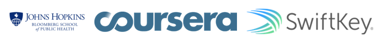

Coursera_DataScienceCapstone_Presentation
========================================================
author: Shashikesh Mishra
date: "Sun Nov 05 2017"
autosize: true
This presentation will briefly but comprehensively pitch an [application](https://skm2506.shinyapps.io/DataScienceCapstoneproject/) for predicting the next word.
This application and presentation is the part of Data Science specialization offered by Johns Hopkins University in cooperation with SwiftKey and Yelp.

A brief Introduction
========================================================
The main purpose of this capstone project is to build a shiny application with the help of R and its associated library that is able to predict the next word.
The preparation of corpus is divided into seven subtasks like such as data cleansing, exploratory analysis, the creation of a predictive model and more.
All text data that is used to create a frequency dictionary and thus to predict the next words come from a corpus called [HC Corpora](http://www.corpora.heliohost.org/).
All text mining and natural language processing were done with the usage of a variety of well-known R packages.

Such as: **Shiny, tm, shinytheme, stylo**

Models and Methods
========================================================
After creating a data sample from the HC Corpora data, this sample was cleaned by conversion to lowercase, removing punctuation, links, white space, numbers and all kinds of special characters.
This data sample was then [tokenized](http://en.wikipedia.org/wiki/Tokenization_%28lexical_analysis%29) into so-called [*n*-grams](http://en.wikipedia.org/wiki/N-gram).
> In the fields of computational linguistics and probability, an *n*-gram is a contiguous sequence of n items from a given sequence of text or speech. ([Source](http://en.wikipedia.org/wiki/N-gram))

* Parts of speech tagging to better understand the context of the user's words
* More data sources (such as books and Reuters Corpus Vol. 1)
* Parallel processing of data to increase volume and speed
* Feedback loop into the model (e.g., learn from what predictions users accept)

Technical And Statistical Architechture
========================================================
The application uses text documents collected from blogs, news articles, and twitter to statistically model language patterns. N-Grams, Markov Model and Katz's back-off model were used to predict the next word. The modeling process used a large set of data so it was batched. The batch process created a much smaller set of data to be used in the application for fast real-time performance.

Additional Information
==========================================================
* The next word prediction app is hosted on shinyapps.io: [https://skm2506.shinyapps.io/DataScienceCapstoneproject/](https://skm2506.shinyapps.io/DataScienceCapstoneproject/)
* The whole code of this application, as well as all the milestone report, related scripts, this presentation  etc. can be found in this GitHub repo: [https://github.com/skm2506/DataScienceCapstoneProject](https://github.com/skm2506/DataScienceCapstoneProject)
* Learn more about the Coursera Data Science Specialization: [https://www.coursera.org/specialization/jhudatascience/1](https://www.coursera.org/specialization/jhudatascience/1)

I found this project and the Data Science Program to be very enjoyable! I learned quite a bit and had fun doing it.
